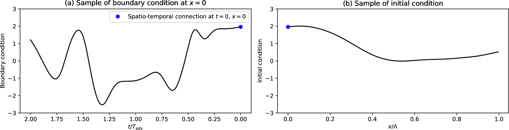
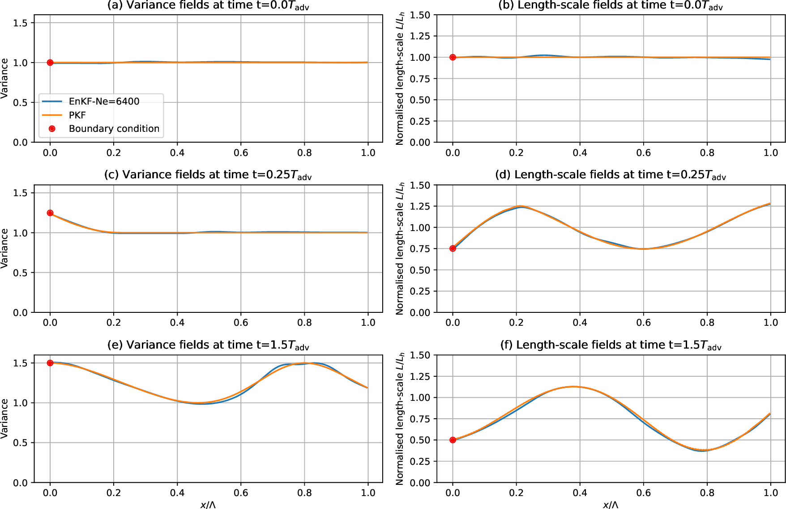
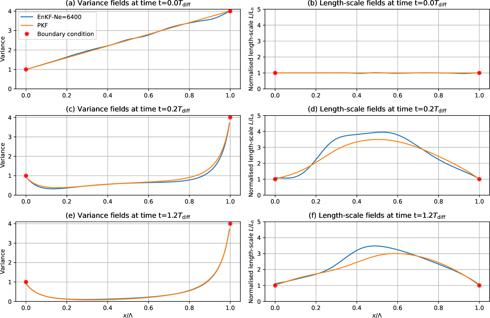
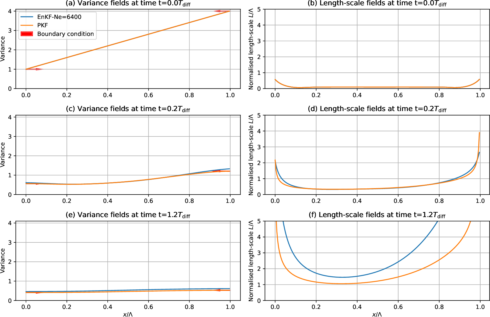

# Boundary Conditions for the Parametric Kalman Filter forecast

## Introduction

This work is a contribution to the exploration of the parametric Kalman filter (PKF), which is an approximation of the Kalman filter, where the error covariance are approximated by covariance model. Here we focus on the covariance model parameterized from the variance and the anisotropy of the local correlations, and whose parameters dynamics provide a proxy for the full error-covariance dynamics. For this covariance mode, we aim to provide the boundary condition to specify in the prediction of PKF for bounded domains, focusing on Dirichlet and Neumann conditions when they are prescribed for the physical dynamics. An ensemble validation is proposed for the transport equation and for the heterogeneous diffusion equation over a bounded 1D domain. This ensemble validation requires to specify the auto-correlation time-scale needed to populate boundary perturbation that leads to prescribed uncertainty characteristics. The numerical simulations show that the PKF is able to reproduce the uncertainty diagnosed from the ensemble of forecast appropriately perturbed on the boundaries, which show the ability of the PKF to handle boundaries in the prediction of the uncertainties. It results that Dirichlet condition on the physical dynamics implies Dirichlet condition on the variance and on the anisotropy.

This repository provides the numerical codes used for the article

***M. Sabathier, O. Pannekoucke, V. Maget and N. Dahmen “Boundary Conditions for the Parametric Kalman Filter forecast,” 2022.***

This work has been supported by the French INSU-LEFE, grant MPKF (multivariate PKF) 

  

[Validation of a PKF forecast for an advection by a heterogeneous wind on a bounded domain](./notebooks/article-boundary-pkf-advection.ipynb)
---------------------

This notebook shows the ability of the PKF to predict the uncertainty dynamics for the advection on a bounded domain, with Dirichlet boundary at $x=0$ and open condition at $x=L$. 

To validate the PKF, an ensemble estimation has been computed to provide a reference. 

To do so, an ensemble of spatio-temporal forcing have been generated as the sample shown in Fig.~1. 

<figure align="center">
  
  <figcaption>Fig.~1: Sample of spatio-temporal error generated to validate the PKF with an ensemble estimation</figcaption>
</figure>

For the validation, a forecast experiment (see Fig.~2) has been performed that shows the ability of the PKF (in orange) to reproduce the ensemble estimation from a very large ensemble size (6400) (in blue). To provide an idea of the efficiency of the PKF approach, it is interesting to note that  the numerical cost of the PKF prediction is thereabout the cost of the computation of three members of the ensemble.

<figure align="center">
  
  <figcaption>Fig.~2: Dynamics of the variance (left column) and of the correlation length-scale (right column) at different times, validating the PKF (orange) by comparison with the ensemble estimation of reference (blue) computed from a large ensemble (6400 members) </figcaption>
</figure>

[Validation of a PKF forecast for the heterogeneous diffusion equation on a bounded domain : Dirichlet boundary conditions](./notebooks/article-boundary-pkf-diffusion-dirichlet.ipynb)
---------------------

This notebook shows the ability of the PKF to predict the uncertainty dynamics for the heterogeneous diffusion equation on a bounded domain, with Dirichlet boundary at $x=0$ and $x=L$. 

To validate the PKF, an ensemble estimation has been computed to provide a reference. For the validation, a forecast experiment (see Fig.~3) has been performed that shows the ability of the PKF (in orange) to reproduce the ensemble estimation from a very large ensemble size (6400) (in blue), except a slight over-estimation of the length-scale at the center of the domain. This defect is minor compared to the good results found for the variance field. Again here, the numerical cost of the PKF prediction is thereabout the cost of the computation of three members of the ensemble.

<figure align="center">
  
  <figcaption>Fig.~3: Dynamics of the variance (left column) and of the correlation length-scale (right column) for an heterogeneous diffusion equation with Dirichet conditions (red dots). The experiment validates the PKF (orange) by comparison with the ensemble estimation of reference (blue) computed from a large ensemble (6400 members) </figcaption>
</figure>

[Validation of a PKF forecast for the heterogeneous diffusion equation on a bounded domain : Neumann boundary conditions](./notebooks/article-boundary-pkf-diffusion-neumann.ipynb)
---------------------

In this notebook, the heterogeneous diffusion equation is considered one more time but with Neumann boundary conditions.

To validate the PKF, an ensemble estimation has been computed to provide a reference. To do so, a forecast experiment (see Fig.~4) has been performed that shows the ability of the PKF (in orange) to reproduce the ensemble estimation from a very large ensemble size (6400) (in blue), except for underestimation of the very large length-scales at the end of the experiment and whose magnitudes are larger than the size of the domain. This defect is minor compared to the good results found for the variance field. Again here, the numerical cost of the PKF prediction is thereabout the cost of the computation of three members of the ensemble.

<figure align="center">
  
  <figcaption>Fig.~4: Dynamics of the variance (left column) and of the correlation length-scale (right column) for an heterogeneous diffusion equation with Neumann conditions (red arrows). The experiment validates the PKF (orange) by comparison with the ensemble estimation of reference (blue) computed from a large ensemble (6400 members) </figcaption>
</figure>

Related works
-------------

[SymPKF package](https://github.com/opannekoucke/sympkf)

O. Pannekoucke, S. Ricci, S. Barthelemy, R. Ménard, and O. Thual, “Parametric Kalman Filter for chemical transport model,” Tellus, vol. 68, p. 31547, 2016, doi: https://doi.org/10.3402/tellusa.v68.31547.

O. Pannekoucke, M. Bocquet, and R. Ménard, “Parametric covariance dynamics for the nonlinear diffusive Burgers’ equation,” Nonlinear Processes in Geophysics, vol. 2018, pp. 1–21, 2018, doi: https://doi.org/10.5194/npg-2018-10.

O. Pannekoucke, R. Ménard, M. El Aabaribaoune, and M. Plu, “A methodology to obtain model-error covariances due to the discretization scheme from the parametric Kalman filter perspective,” Nonlinear Processes in Geophysics, vol. 28, no. 1, pp. 1–22, 2021, doi: https://doi.org/10.5194/npg-28-1-2021.

O. Pannekoucke, “An anisotropic formulation of the parametric Kalman filter assimilation,” Tellus A: Dynamic Meteorology and Oceanography, vol. 73, no. 1, pp. 1–27, Jan. 2021, doi: https://doi.org/10.1080/16000870.2021.1926660.

O. Pannekoucke and P. Arbogast, “SymPKF (v1.0): a symbolic and computational toolbox for the design of parametric Kalman filter dynamics,” Geoscientific Model Development, vol. 14, no. 10, pp. 5957–5976, Oct. 2021, doi: https://doi.org/10.5194/gmd-14-5957-2021.

[Pannekoucke2016T]: https://doi.org/10.3402/tellusa.v68.31547 "O. Pannekoucke, S. Ricci, S. Barthelemy, R. Ménard, and O. Thual, “Parametric Kalman Filter for chemical transport model,” Tellus, vol. 68, p. 31547, 2016, doi: 10.3402/tellusa.v68.31547."

[Pannekoucke2018NPG]: https://doi.org/10.5194/npg-2018-10 "O. Pannekoucke, M. Bocquet, and R. Ménard, “Parametric covariance dynamics for the nonlinear diffusive Burgers’ equation,” Nonlinear Processes in Geophysics, vol. 2018, pp. 1–21, 2018, doi: https://doi.org/10.5194/npg-2018-10."

[Pannekoucke2020NPG]: https://doi.org/10.5194/npg-28-1-2021 "O. Pannekoucke, R. Ménard, M. El Aabaribaoune, and M. Plu, “A methodology to obtain model-error covariances due to the discretization scheme from the parametric Kalman filter perspective,” Nonlinear Processes in Geophysics, vol. 28, no. 1, pp. 1–22, 2021, doi: 10.5194/npg-28-1-2021."

[Pannekoucke2021T]: https://doi.org/10.1080/16000870.2021.1926660 "O. Pannekoucke, “An anisotropic formulation of the parametric Kalman filter assimilation,” Tellus A: Dynamic Meteorology and Oceanography, vol. 73, no. 1, pp. 1–27, Jan. 2021, doi: 10.1080/16000870.2021.1926660."

[Pannekoucke2021GMD]: https://doi.org/10.5194/gmd-14-5957-2021 "O. Pannekoucke and P. Arbogast, “SymPKF (v1.0): a symbolic and computational toolbox for the design of parametric Kalman filter dynamics,” Geoscientific Model Development, vol. 14, no. 10, pp. 5957–5976, Oct. 2021, doi: 10.5194/gmd-14-5957-2021."

